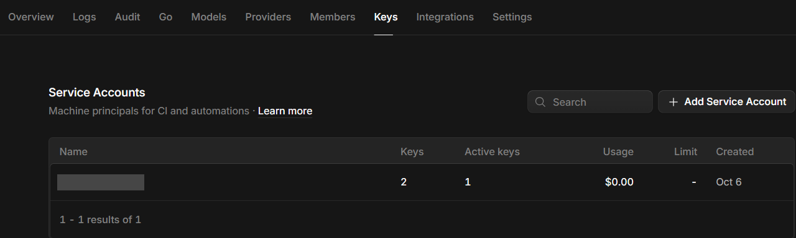
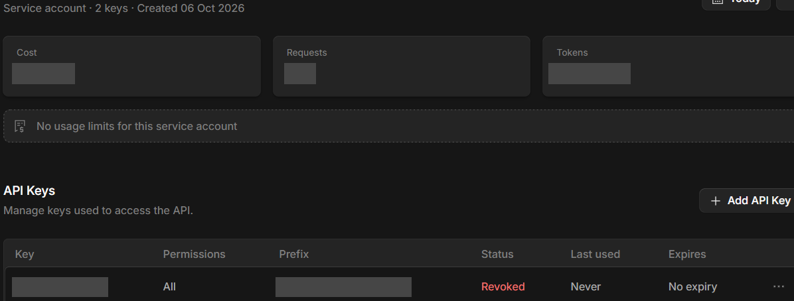

# 單元 1：在 Windows 用終端機安裝 AI Agent

> **ver. 1.1** ｜ **Last edited: 2026-10-08** ｜ 預估 5 分鐘／工具 ｜ Windows 10／11 ｜ Claude Code／Codex／OpenCode／Gemini CLI

> [!IMPORTANT]
> Windows 原生安裝的 AI Agent **看得到你的整個使用者資料夾**，能讀寫檔案、也能執行指令：只在專用的練習資料夾啟動，重要檔案先備份。
> 你輸入的內容會送到你選的模型供應商：不要放機密資料，API key 與登入資訊自己保管。

---

## 💡 這個單元在做什麼

AI Agent 是在終端機裡讀寫你專案檔案、執行指令的 AI 程式設計助手。本單元在 Windows 10／11 的 PowerShell 安裝四種：**Claude Code、Codex CLI、OpenCode、Gemini CLI**。不需要先設定 WSL。四個工具彼此獨立，裝你需要的就好。

```text
單元 1
├─ 1 前置檢查（你做）：Windows 版本、PowerShell、git、Node.js
├─ 2 通則（規範）：先下載、審閱，再執行安裝腳本
├─ 3 安裝（擇需）
│   ├─ 3.1 Claude Code
│   ├─ 3.2 Codex CLI
│   ├─ 3.3 OpenCode
│   └─ 3.4 Gemini CLI
├─ 4 驗證（你做）：版本、登入、啟動、更新
└─ 5 使用前注意（規範）：隔離、隱私、金鑰
```

| 工具 | 廠商 | 登入方式 | Windows 安裝方式 |
|:--|:--|:--|:--|
| Claude Code | Anthropic | Pro／Max／Team／Enterprise／Console 帳號（免費 claude.ai 方案不含） | PowerShell 腳本、CMD、WinGet、npm |
| Codex CLI | OpenAI | ChatGPT 帳號（Plus、Pro、Business、Edu、Enterprise）或 API key | PowerShell 腳本、npm |
| OpenCode | 開源（anomalyco） | 自備任一模型供應商的 API key | npm、Scoop、Chocolatey |
| Gemini CLI | Google | Google 帳號登入、Gemini API key 或 Vertex AI | npm、npx |

---

## 🚀 1. 前置檢查

開始功能表搜尋 `PowerShell`，開啟一般的 Windows PowerShell 即可，**不需要系統管理員**。提示符號是 `PS C:\Users\你的名稱>`。

| # | 確認項目 | 怎麼確認 | 沒通過時 |
|:-:|:--|:--|:--|
| 1 | Windows 10 或 11，64 位元 | `winver` | 先更新 Windows |
| 2 | 開的是 PowerShell，不是 CMD | 提示符號開頭有 `PS` | 重開 PowerShell；PowerShell 與 CMD 的指令不同 |
| 3 | 有 `git`（建議） | `git --version` | 展開下方「安裝 Git for Windows」 |
| 4 | 有 Node.js（npm 路線需要；之後接 agent-kit 的 Claude Code 攔截防護也要用） | `node --version` | 展開下方「安裝 Node.js」 |
| 5 | 帳號或 API key 已備好 | 見上方工具表 | 先申請，再回來安裝 |
| 6 | 有 `gh` 並已登入（只有之後要接 agent-kit 時需要） | `gh auth status` | 安裝與登入步驟在 agent-kit 的 `INSTALL.md` 第 1 層，不在本單元 |

<details>
<summary><strong>安裝 Git for Windows（沒有 git 時展開）</strong></summary>

```powershell
winget install --id Git.Git -e --source winget
```

Claude Code 在 Windows 原生執行時，有 Git for Windows 就用 Git Bash 當 Bash 工具，沒有就用 PowerShell 當 shell 工具，兩者都能用，官方建議安裝。其他工具也常會呼叫 `git`。裝完**關掉 PowerShell 再開新的**。

</details>

<details>
<summary><strong>安裝 Node.js（沒有 node 時展開）</strong></summary>

```powershell
winget install --id OpenJS.NodeJS.LTS -e --source winget
```

裝完同樣關掉 PowerShell 再開新的，用 `node --version`、`npm --version` 確認。

> [!NOTE]
> 各工具對 Node.js 版本的下限不同（Claude Code 的 npm 方式官方要求 Node.js 22 以上），請以官方文件為準。只用 Claude Code 或 Codex 的腳本安裝時，不需要 Node.js。

</details>

---

## 🧭 2. 通則：先看腳本，再執行

四個工具中，Claude Code 與 Codex 官方都提供「`irm 網址 | iex`」一行式安裝，會直接執行網路上的腳本。教學環境的做法是**先下載、看過、再執行**：

| # | 規範 |
|:-:|:--|
| 1 | **確認網域**：下載網址必須是官方網域。 |
| 2 | **不放寬執行原則**：不為了省事全域放寬 PowerShell 執行原則；需要時只對單次行程放行。 |
| 3 | **不明來源不貼**：不明來源的指令不要直接貼進終端機。 |

> [!WARNING]
> 看不懂的腳本、網域不對的下載，**停下來**，不要執行。

---

## 🛠️ 3. 安裝 AI Agent

以下四個工具各自獨立，只裝你需要的。每個工具的方法擇一即可。

### 3.1 Claude Code

三種方法擇一。**推薦方法 A**：原生安裝，會在背景自動更新。

#### 方法 A：PowerShell 原生安裝（推薦）

```powershell
cd ~
irm https://claude.ai/install.ps1 -OutFile claude-install.ps1
(Get-Content .\claude-install.ps1 | Measure-Object -Line).Lines
notepad .\claude-install.ps1
```

我們審閱過的版本（2026-10-07 下載，約 110 行）做的事：

- 只支援 64 位元 Windows，依 CPU 選 `win32-x64` 或 `win32-arm64`。
- 從 `downloads.claude.ai/claude-code-releases` 取得最新版本號與 `manifest.json`。
- 下載 `claude.exe`，**比對 manifest 內的 SHA256 校驗碼**，不符就刪檔並中止。
- 執行 `claude.exe install` 設定啟動器與 shell 整合，然後刪除暫存的安裝檔。

> [!IMPORTANT]
> 審閱時確認網址都是 `downloads.claude.ai`，再執行下面這行。

```powershell
Get-Content .\claude-install.ps1 -Raw | Invoke-Expression
```

> [!NOTE]
> 用 `Get-Content ... | Invoke-Expression`，是因為 Windows 預設的執行原則可能擋下直接執行下載的 `.ps1` 檔。想省略審閱，可直接用官方一行式 `irm https://claude.ai/install.ps1 | iex`。

#### 方法 B：CMD 安裝

在 CMD（提示符號沒有 `PS`）執行：

```batch
curl -fsSL https://claude.ai/install.cmd -o install.cmd && install.cmd && del install.cmd
```

在 PowerShell 貼這行會出現 `The token '&&' is not a valid statement separator`；在 CMD 貼 `irm ...` 會出現 `'irm' is not recognized`。看到這兩個錯誤，就是用錯終端機了。

#### 方法 C：WinGet

```powershell
winget install Anthropic.ClaudeCode
```

> [!NOTE]
> WinGet 安裝**不會自動更新**，要定期執行 `winget upgrade Anthropic.ClaudeCode`。

#### 其他：npm

```powershell
npm install -g @anthropic-ai/claude-code
```

裝的是同一個原生執行檔。升級用 `npm install -g @anthropic-ai/claude-code@latest`，不要用 `npm update -g`。

### 3.2 Codex CLI

#### 方法 A：官方 PowerShell 腳本

官方 Windows 指令：

```powershell
powershell -ExecutionPolicy ByPass -c "irm https://chatgpt.com/codex/install.ps1 | iex"
```

這個腳本約 1200 行，不適合逐行手動審閱。我們掃過的內容：它從 `releases.openai.com`（失敗時退回 GitHub Releases）下載，**比對 SHA-256 摘要**，不符就中止。`-ExecutionPolicy ByPass` 只作用在這一次的 PowerShell 行程，不會改動系統設定。

想先留一份腳本備查，可以另外下載：

```powershell
cd ~
irm https://chatgpt.com/codex/install.ps1 -OutFile codex-install.ps1
```

#### 方法 B：npm（腳本太長不想用時）

```powershell
npm install -g @openai/codex
```

### 3.3 OpenCode

> [!NOTE]
> OpenCode 官方文件的 Windows 說明是：「可以直接在 Windows 上執行，但建議用 WSL 以獲得最佳體驗」。以下是原生 Windows 的安裝方式。

| 方法 | 指令 | 前提 |
|:--|:--|:--|
| npm | `npm install -g opencode-ai` | 已安裝 Node.js |
| Scoop | `scoop install opencode` | 已安裝 Scoop |
| Chocolatey | `choco install opencode` | 已安裝 Chocolatey，需系統管理員 PowerShell |

官方文件另提到 Bun 在 Windows 的安裝支援還在進行中，不建議用 Bun。官方的 `curl ... | bash` 腳本是 Linux／macOS 用的，不能在 PowerShell 執行。

已有 Node.js 的人用 npm 最直接：

```powershell
npm install -g opencode-ai
```

啟動後用 `/connect` 設定供應商並輸入你自己的 API key。已有其他供應商的人直接選自己的供應商；還沒有的人，照下面的 OpenCode Zen 免費模型路線取得金鑰。

#### 取得 API key 並連線（OpenCode Zen 免費模型）

```text
登入 OpenCode 網站
     │
     ▼
① Keys 頁籤 ──▶ Service Accounts ──▶ Add Service Account
     │
     ▼
② 點進該 Service Account ──▶ API Keys 區 ──▶ Add API Key（金鑰只顯示一次）
     │
     ▼
③ 終端機執行 opencode ──▶ /connect ──▶ 選 OpenCode Zen ──▶ 貼上金鑰
     │
     ▼
④ /models ──▶ 選名稱帶 Free 的模型
```

1. 登入 OpenCode 網站，進入 **Keys** 頁籤，在 **Service Accounts** 按 **Add Service Account**，取一個好認的名稱。

   

2. 點進剛建立的 Service Account，在 **API Keys** 區按 **Add API Key**。**完整金鑰只顯示一次**：建立後立刻複製，不要貼到聊天、文件或 Git；沒複製到就撤銷後重建。

   

3. 回到終端機執行 `opencode`，輸入 `/connect`，選 **OpenCode Zen**，貼上金鑰。
4. 輸入 `/models`，選名稱帶 **Free** 的模型。

> [!NOTE]
> 截圖已遮蔽帳號名稱、金鑰前綴與用量數字；你自己的畫面會顯示完整內容，請勿把它們貼給別人。這個網頁流程是作者 2026-10-08 依實際畫面整理，官方文件沒有逐步寫出，介面改版時以畫面為準。

> [!WARNING]
> - 金鑰存在本機 `~/.local/share/opencode/auth.json`，是**明文**檔（作者在 Windows 11 查到，官方的加密方式未查證）：不要放進 Git、雲端同步資料夾，也不要分享給別人。
> - 不用的金鑰到網頁上撤銷（Revoked），不要留著。
> - 免費模型的名稱、額度與是否持續免費會變動，以 `/models` 清單與網站為準；內容是否被用於訓練，請先看供應商條款再決定能送什麼資料。

### 3.4 Gemini CLI

```powershell
npm install -g @google/gemini-cli
```

不想全域安裝、只想試用：

```powershell
npx @google/gemini-cli
```

登入有三種：Google 帳號（OAuth）、Gemini API key（到 aistudio.google.com/apikey 取得）、Vertex AI（企業用，需計費帳戶）。免費額度與限制會變動，以官方 repo 說明為準。

---

## ✅ 4. 驗證、啟動與更新

**每個工具裝完，關掉 PowerShell 開新的**（讓 PATH 生效），再驗證：

```powershell
claude --version
codex --version
opencode --version
gemini --version
```

只會有你裝過的那幾個有輸出，沒裝的會顯示找不到指令，這是正常的。Claude Code 另有診斷指令：

```powershell
claude doctor
```

**啟動：** 一律先進入專用的練習資料夾，再執行指令。第一次啟動會引導登入（瀏覽器或貼上 API key）：

```powershell
mkdir ~\projects\demo
cd ~\projects\demo
claude     # 或 codex、opencode、gemini
```

| 工具 | 啟動 | 更新 |
|:--|:--|:--|
| Claude Code | `claude` | `claude update`（原生安裝會自動更新；WinGet 用 `winget upgrade Anthropic.ClaudeCode`） |
| Codex CLI | `codex` | 重跑安裝腳本，或 `npm install -g @openai/codex@latest` |
| OpenCode | `opencode` | `opencode upgrade`（npm 安裝亦可重跑 `npm install -g opencode-ai`） |
| Gemini CLI | `gemini` | `npm install -g @google/gemini-cli@latest` |

OpenCode 常用指令（來自 `opencode --help`）：

| 指令 | 用途 |
|:--|:--|
| `opencode` | 開啟 TUI（預設） |
| `opencode run "訊息"` | 不開 TUI，直接送出一則訊息 |
| `opencode providers` | 管理 AI 供應商與認證 |
| `opencode models` | 列出可用模型 |
| `opencode uninstall` | 移除 OpenCode 與相關檔案 |

> [!IMPORTANT]
> 🎉 **完成條件**：至少一個工具的 `--version` 顯示版本號，並且能在練習資料夾啟動、完成登入。

---

## 🔒 5. 使用前請注意

> [!IMPORTANT]
> **Windows 原生的 AI Agent 看得到你的整個使用者資料夾。** 它們能讀寫檔案、也能執行指令。請只在專用的練習資料夾（例如 `~\projects\demo`）啟動，不要在家目錄或放機密資料的資料夾啟動；重要檔案先備份或用 Git 存版本。需要與 Windows 隔離時，改用[單元 3](https://ryan-chpeng.github.io/AI-agent-start/unit-3.html) 建立 Linux 環境。

> [!IMPORTANT]
> **內容會送給模型供應商，金鑰自己保管。** 這些工具會把你的程式碼與提示傳給你選的供應商，教學時不要放機密資料。API key 與登入資訊不要貼在聊天室、截圖或公開的程式碼庫。認證資料存放在哪裡，本文沒有逐一查證，使用前請先看各工具官方文件。

> [!WARNING]
> 全域 npm 安裝不要用管理員權限硬裝。遇到權限錯誤，改用該工具的腳本、WinGet 或 Scoop。

> [!NOTE]
> 受邀的同事可以接著用 [agent-kit-team](https://github.com/ryan-chpeng/agent-kit-team/blob/main/INSTALL.md) 的 `INSTALL.md`（私有 repo，要先被邀請）：它會幫你建工作資料夾、規則、記憶，並安裝攔截危險指令的防護，降低 Windows 原生 Agent 誤刪檔案的風險。這套防護支援 Claude Code、Codex、OpenCode，**不含 Gemini CLI**，也不適用裝在 WSL 內的 Agent。

---

## ❓ 常見問題

| 問題 | 回答 |
|:--|:--|
| 指令找不到（`claude`、`codex`、`opencode`、`gemini`）？ | 關掉終端機開新的；仍找不到是 PATH 還沒包含安裝目錄，用 `where.exe 指令名` 確認。 |
| `The token '&&' is not a valid statement separator`？ | 你在 PowerShell 貼了 CMD 的指令，改用方法 A。 |
| `'irm' is not recognized as an internal or external command`？ | 你在 CMD 貼了 PowerShell 的指令，改開 PowerShell。 |
| 安裝時出現 `403` 或連線錯誤？ | 檢查網路、VPN 或公司代理是否擋住對應網域（`claude.ai`、`downloads.claude.ai`、`chatgpt.com`、`releases.openai.com`、`registry.npmjs.org`）。 |
| 提示所在地區不支援？ | 各工具對國家與地區有各自限制，見官方文件（Claude Code 見 Anthropic supported countries）。 |
| 直接執行 `.ps1` 被擋（執行原則）？ | 用本文的 `Get-Content ... \| Invoke-Expression`，或官方指令的行程內 `-ExecutionPolicy ByPass`；不要全域放寬。 |
| `npm` 找不到？ | 先安裝 Node.js（第 1 節），並重開 PowerShell。 |
| `npm` 權限錯誤？ | 不要用管理員權限硬裝；改用腳本、WinGet 或 Scoop。 |
| 想移除 Claude Code？ | WinGet 安裝用 `winget uninstall Anthropic.ClaudeCode`；原生安裝請照官方 Uninstall 章節，並先確認要刪的路徑。 |

---

## 📋 版本與驗證範圍

本單元依各工具官方文件（查閱日 2026-10-07）整理，並讀過 `https://claude.ai/install.ps1` 全文（約 110 行）與 `https://chatgpt.com/codex/install.ps1` 的關鍵段落（約 1200 行，只掃過，沒有逐行審閱）。**沒有執行任何安裝腳本。**

**尚未在乾淨的 Windows 上實測，請照做時留意**：

- Claude Code 方法 A 的「先下載、審閱，再用 `Invoke-Expression` 執行」流程（官方只給一行式）、方法 B（CMD）、方法 C（WinGet）。
- Codex CLI 的腳本與 npm 方式、Gemini CLI 的 npm 與 npx、OpenCode 的 npm／Scoop／Chocolatey。
- 各工具在 Windows Terminal 下的顯示效果，以及登入與供應商連線流程。
- 各工具的更新指令（Codex、Gemini CLI 的更新方式是依 npm 慣例推定，官方頁面未逐項列出）。
- 各工具的 Node.js 版本下限（只有 Claude Code 的 npm 方式官方明確寫 Node.js 22 以上）。

## 📚 出處

- [Claude Code：Advanced setup](https://code.claude.com/docs/en/setup)：系統需求、Windows 原生安裝（PowerShell、CMD、WinGet、npm）、Git for Windows、驗證、登入、更新與移除。
- [Claude Code：Troubleshoot installation and login](https://code.claude.com/docs/en/troubleshoot-install)：PATH、`403`、各種安裝錯誤。
- [OpenAI Codex CLI（GitHub）](https://github.com/openai/codex)：Windows 安裝指令、npm 安裝、登入方式。
- [OpenCode：Install](https://opencode.ai/docs/)：npm、Scoop、Chocolatey 等安裝方式、Windows 注意事項。
- [OpenCode：Windows (WSL)](https://opencode.ai/docs/windows-wsl/)：Windows 建議使用 WSL。
- [Gemini CLI（GitHub）](https://github.com/google-gemini/gemini-cli)：npm、npx 安裝與登入方式。
- 本機審閱：`https://claude.ai/install.ps1`（2026-10-07，全文）、`https://chatgpt.com/codex/install.ps1`（2026-10-07，關鍵段落）。

> **授權與來源**：本文內容以 [CC BY 4.0](https://creativecommons.org/licenses/by/4.0/) 授權，轉載或改作請標示出處。下一步：[單元 2：開局前環境配置](https://ryan-chpeng.github.io/AI-agent-start/unit-2.html)；受邀同事可在單元 2 之後做上面第 5 節提到的 agent-kit。
